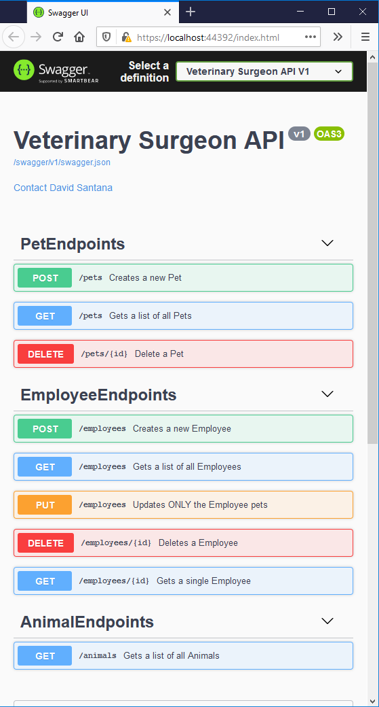
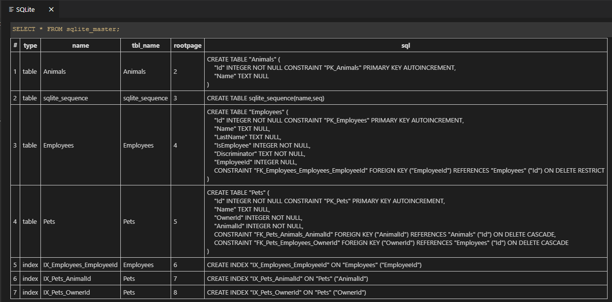
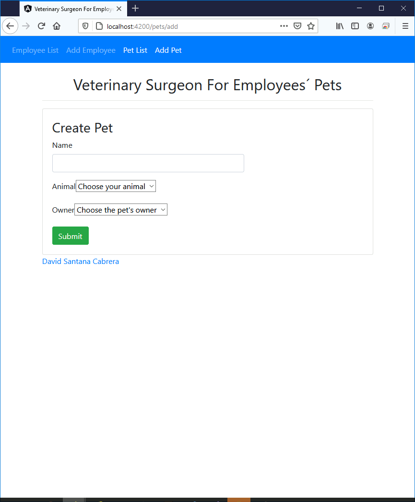

# Veterinary Surgeon Test

The motivation for developing the next solution is to demonstrate how to apply clean architectures, SOLID principles and DDD practices. Clearly such an architecture for the problem is over-engineering, but it serves as an example.

The chosen architecture is based on the one proposed by Microsoft in its project [eShopOnWeb](https://github.com/dotnet-architecture/eShopOnWeb) and specifically what the engineer [Steve "Ardalis" Smith](https://github.com/ardalis) proposes whom I met on the famous [.Net Rocks](https://www.dotnetrocks.com/) podcast.

## Architecture

There are 4 projects:
1. Web: Contains the API endpoints.
1. Application: Contains the service layer used by the API.
1. Infrastructure: Contains base elements of the application such as the database repository.
1. Core: Contains the business entities.

It is important to note that Web needs Application to access data through the interfaces it exposes.

There are several models to communicate between projects.
1. Request and Response objects for input and output of the Web project to the API client.
1. DTO objects between the Application and Web project.
1. Entity objects between the Application and Core project.

These objects include mappers to transform from one type to another. I could have used Automapper to avoid doing it manually, but I wanted to demonstrate how to do it manually.

### Web project (startup project)

* In each execution of the project the database is populated if it was not using the SeedData class.
* Swagger has been configured for API documentation and testing.
* Policy was created to enable CORS only for the Angular domain. Also all methods are allowed.
* Application services are injected using extension methods created in the Application project. The same occurs with the Database Context which has been prepared to use SQLite and localdb.
* There is a different class for each API endpoint. This discards the *"Controller"* classes that tend to break the principle of sole responsibility.
* Ardalis's nuget package [ApiEndPoints](https://github.com/ardalis/ApiEndpoints) is used to build the endpoints; basically it is a controller that needs to know what the input and request objects it handles.

### Project Application

* Specification are used for query handling, paging, inclusion of dependent objects, filters, etc. For them we use the nuget package [Specification](https://github.com/ardalis/Specification) from Ardalis.
* The Services directory contains the interfaces to which Web has access, their implementations and DTOs for data transfer. I could improve this folder structure, but I left for simplicity.
* This project is from where you can attack the data source through the repositories so it has a dependency with Core (who contains the entities)
* Includes a class with dependency container extension methods: StartupSetup.
  * To improve: The created interfaces do not comply with the principle of Interface Segregation and could be atomized a little more.
  * To improve: All public methods must have powerful exception handling, but I didn't have time to implement it. Much better option would have been to implement Notifications instead of exceptions ([Martin Fowler](https://martinfowler.com/articles/replaceThrowWithNotification.html))

### Core Project

* Entities have their own characteristics of DDD as constructors and private setters or rich models (not just getters and setters)
* The Employee entity has a read property that calculates the number of pets. This could be replaced by an interface method, but I am a fan of calculating or operating as close as possible to the input data and I think this is the best solution.
* Only two interfaces are included as Core members: one for data access (the generic repository) and the other to handle logs. They are two concepts of infrastructure, so their implementation is in the Infrastructure project.

### Infrastructure Project
* Define the database context using FluentApi. I prefer this method to entity annotations.
* The repository implementation is generic and classical implementation.
* Another option would have been not to use repositories but directly the Context. Implementing repositories is adding a wrapper to the Context that already follows the repository pattern (UnitOfWork, independence, ...)
* Includes a class with dependency container extension methods: StartupSetup.

## Database

I did not have DBMS installed and Docker on the machine where I did the test does not work correctly so I had to use SQLite.

## Angular Client

* It is located in the veterinarySurgeon-client directory and can be launched with `ng serve` from there.
* A service has been created for the management of each entity: employee, animal and pet. These services are those consumed by the .net API
* There are 5 entity models: 3 for reading and 2 for writing (one to create employees and another to create pets). To the writing models I put the suffix Command (alluding to CQRS ;-)
* I created one component per screen:
  1. List of employees
  1. Detail of employees
  1. Employee creation
  1. List of pets
  1. Pet creation
* Booleans needed to be rendered as Yes / No while the API returns True / False so I have created a pipe to do the transformation.
* For the creation of Pets I used FormBuilder although it is still to be finished.
* For the Employee creation I used ngModel and although the API works (tested with Swagger) I still have CORS problems.
* The structure of the App directory can be improved although I decided to leave it flat for simplicity.

## Next steps

1. Add unit tests to both the Back and Front project
1. Add error handling
1. Add authentication and authorization system with JWT
1. Return more restful response objects by adding meta information or hateoas